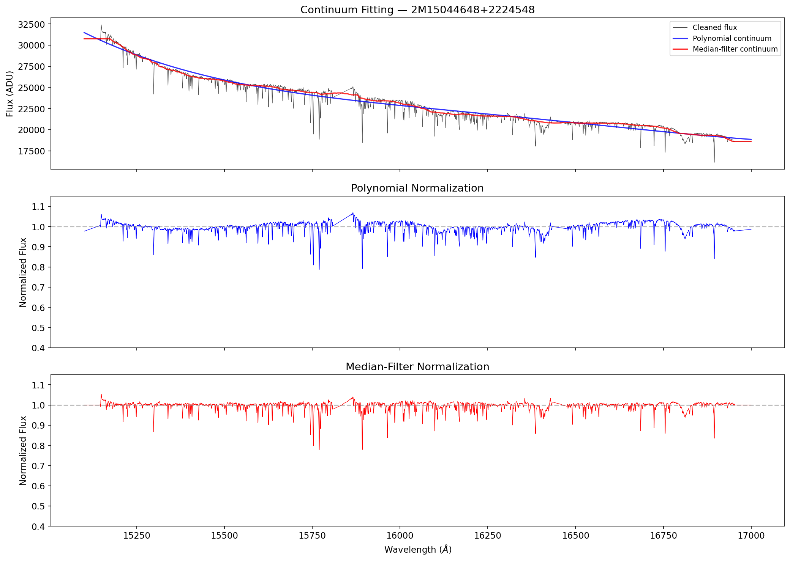
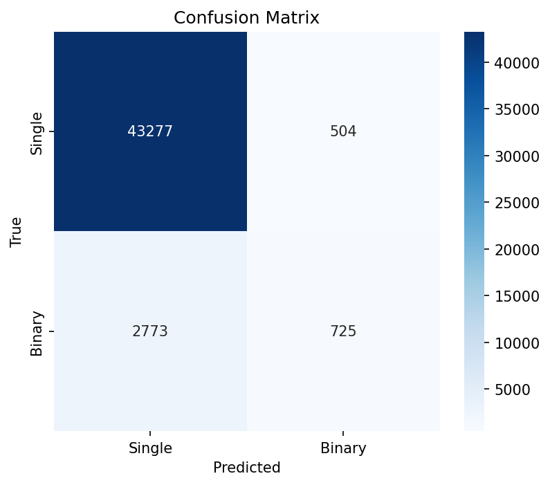
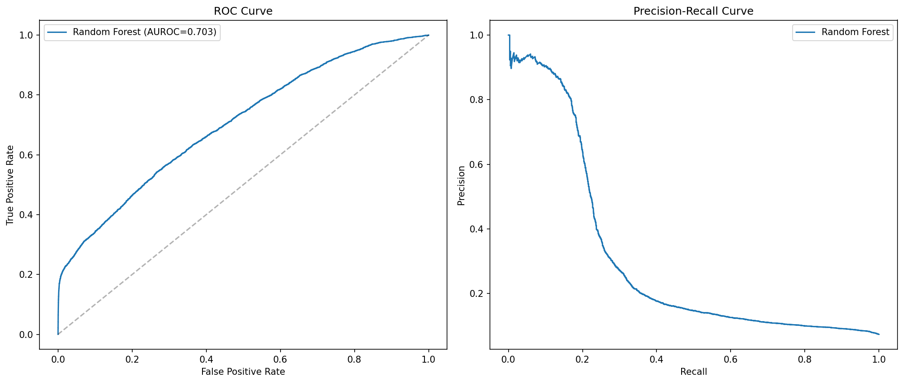
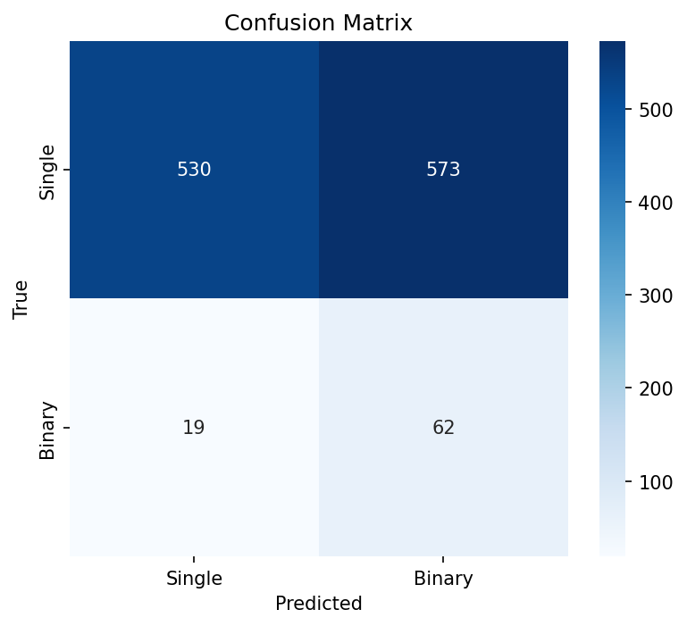

# Binary Star Detection from Single-Epoch Spectra

Detecting binary star candidates from single-epoch APOGEE DR17 H-band spectra using machine learning. The core idea: train a 1D CNN to recognize subtle spectral signatures of binarity (line broadening, dilution, asymmetry) from a single observation, without requiring multi-epoch radial velocity monitoring.

## Motivation

Most stars have only 1-2 spectral observations. Traditional binary detection requires multiple epochs to measure radial velocity (RV) variability, limiting discovery to well-observed targets. Single-epoch detection from spectral signatures could dramatically expand the known binary census.

## Data

- **Source:** SDSS-IV APOGEE DR17 allStarLite catalog (~650K stars)
- **Working sample:** 315,189 stars after quality cuts (SNR >= 50, NVISITS >= 3, clean flags, Teff 3500-7000 K)
- **Labels:** Based on RV scatter (VSCATTER) — binary (>1 km/s), single (<0.3 km/s), intermediate zone discarded
- **Class balance:** 23,318 binary (7.4%) / 291,871 single (92.6%)
- **Spectra:** H-band (1.51-1.70 um), R~22,500, 8,575 pixels per spectrum

## Label Validation

Cross-matched against known binary catalogs:

| Catalog | Matches | Our Binary | Our Single | Precision |
|---------|---------|-----------|-----------|-----------|
| SB9 | 109 | 77 | 32 | 70.6% |
| Gaia DR3 NSS | 1,300 | 650 | 650 | 50.0% |

SB9 recovery (71%) validates the VSCATTER approach for RV-variable systems. Lower Gaia recovery (50%) is expected — Gaia detects astrometric and eclipsing binaries that may not show RV variability.

## Spectral Signatures

Binary stars show subtle but measurable differences in their spectra compared to single stars of similar type:

- **CCF FWHM:** 25% broader in binaries (28.9 vs 36.3 km/s) due to line broadening from the companion
- **Bisector span:** 8x more asymmetric in binaries (-0.019 vs -0.154) from blended line profiles
- **Line depths:** Systematically shallower across all absorption regions (Mg I, Fe I, Al I, CO) due to continuum dilution by the companion

These differences are invisible by eye but detectable by ML across thousands of spectral pixels simultaneously.



## Results

### Random Forest Baseline (catalog features only)

Trained on 5 catalog parameters (Teff, logg, [Fe/H], SNR, NVISITS) — no spectral information.

| Metric | Value |
|--------|-------|
| AUROC | 0.703 |
| Binary recall | 21% |
| Binary precision | 59% |
| Accuracy | 93% |




### 1D CNN (10K spectra, initial run)

Trained on continuum-normalized APOGEE spectra (8,575 pixels). 3 convolutional blocks with BatchNorm, AdaptiveAvgPool, and FC classifier head (1.1M parameters).

| Metric | Value |
|--------|-------|
| AUROC | 0.712 |
| Binary recall | 77% |
| Binary precision | 10% |
| Accuracy | 50% |



### Comparison

| Metric | RF (catalog) | CNN (spectra) |
|--------|-------------|---------------|
| AUROC | 0.703 | 0.712 |
| Binary recall | 21% | 77% |
| Binary precision | 59% | 10% |

The CNN finds far more binaries (77% vs 21% recall) by detecting spectral patterns invisible to catalog features. Precision is low with only 10K training spectra — expected to improve significantly with more data (val AUROC improved from 0.69 to 0.74 going from 550 to 10K spectra).

## Project Structure

```
binary-star-detection/
├── config.py                          # Centralized configuration
├── src/
│   ├── data.py                        # APOGEE data access (Fornax-aware)
│   ├── preprocessing.py               # Continuum normalization, masking
│   ├── features.py                    # CCF, absorption line measurements
│   ├── models.py                      # 1D CNN + RF definitions
│   ├── rv.py                          # RV measurement, orbit fitting
│   └── utils.py                       # Plotting, metrics
├── notebooks/
│   ├── 01_data_exploration/           # Catalog access, sample selection
│   ├── 02_label_generation/           # VSCATTER labels, catalog cross-match
│   ├── 03_feature_engineering/        # Spectral preprocessing, hand-crafted features
│   ├── 04_modeling/                   # RF baseline, CNN, comparison
│   └── 05_validation/                 # Classical RV analysis, novel candidates
├── figures/
└── lab-notes/
```

## Setup

```bash
git clone https://github.com/saanikakulkarni07/binary-star-detection.git
cd binary-star-detection
pip install -e .
```

Run notebooks in order from `01_data_exploration/` through `05_validation/`. Designed to run on [NASA Fornax Science Console](https://fornax.sci.stsci.edu/) for fast data access and GPU compute.

## Next Steps

- Scale CNN training to 50K+ spectra to improve precision
- Run full model comparison (ROC/PR overlay, McNemar test)
- Classical RV validation of top CNN candidates (Lomb-Scargle, Keplerian orbit fitting)
- Build final candidate catalog of novel binary detections
